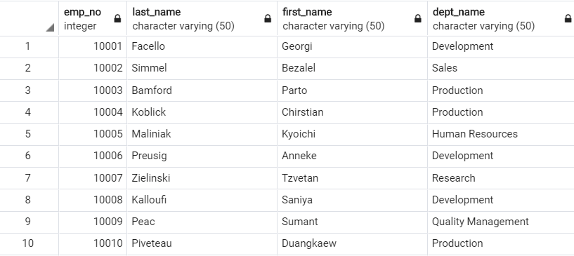

# SQL-Challenge

## Employee Database: A Mystery in Two Parts

* Objective: Using multiple data analysis tools to query a database of employees from a period of 1980s - 1990s that are six CSV files.

* Tools: PostgresSQL, Python, Pandas, SQLalchemy ORM, Matplotlib.

## Entity Relationship Diagram (ERD)

## Part I - Queries in SQL

* List the following details of each employee: employee number, last name, first name, gender, and salary.

"Snippet of output data - not all inclusive"

* List employees who were hired in 1986.

"Snippet of output data - not all inclusive"

* List the manager of each department with the following information: department number, department name, the manager's employee number, last name, first name, and start and end employment dates.

"Snippet of output data - not all inclusive"

* List the department of each employee with the following information: employee number, last name, first name, and department name.

"Snippet of output data - not all inclusive"

* List all employees whose first name is "Hercules" and last names begin with "B."

"Snippet of output data - not all inclusive"

* List all employees in the Sales department, including their employee number, last name, first name, and department name.

"Snippet of output data - not all inclusive"

* List all employees in the Sales and Development departments, including their employee number, last name, first name, and department name.

"Snippet of output data - not all inclusive"

* In descending order, list the frequency count of employee last names, i.e., how many employees share each last name.

"Snippet of output data - not all inclusive"

## Part II - Import the SQL database into Pandas and perform queries using SQLalchemy

* Create a histogram to visualize the most common salary ranges for employees.

	* Summary Table

* Create a bar chart of average salary by title.

	* Summary Table

